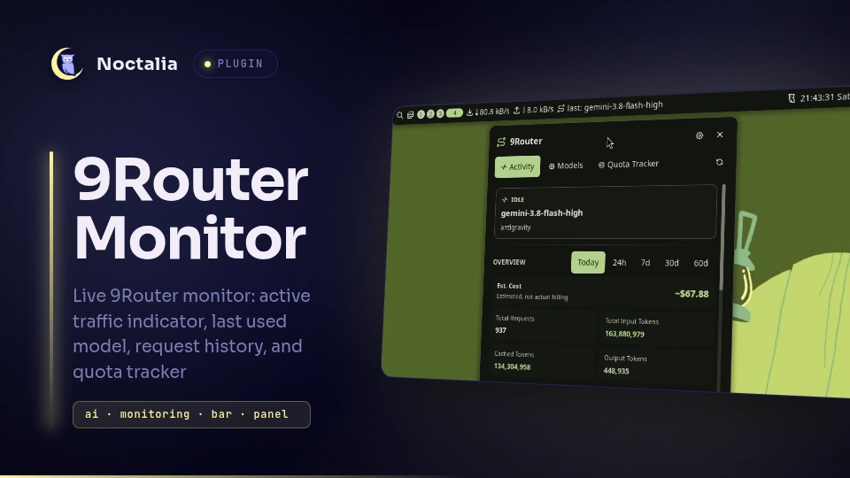

# 9Router Monitor for Noctalia

A navbar pill and interactive popup panel for monitoring the [9Router](https://github.com/decolua/9router) dashboard in [Noctalia](https://noctalia.dev) v5+.

Inspired by [omarchy-9router-monitor](https://github.com/jhonoryza/omarchy-9router-monitor) in the omarchy ecosystem, ported and rebuilt as a native, zero-dependency Luau plugin for Noctalia v5+.



## What it does

- **Always-visible pill** in the Noctalia Bar:
  - `last: <model>` when idle in theme foreground.
  - `<model>` in `primary` accent with activity glyph when traffic is flowing through 9Router.
  - `login needed` in `error` color when dashboard authentication is required.
  - `offline` when the 9Router server cannot be reached.
- **Instant live updates** — follows the 9Router Server-Sent Events (SSE) stream (`/api/usage/stream`), updating the bar immediately upon request start/finish.
- **Smart busy detection** — keeps the active indicator alive for 12 seconds after a request arrives, refreshed by subsequent requests.
- **Dual authentication modes**:
  - **Zero-config auto-auth**: Automatically reads local CLI secrets (`~/.9router/machine-id` and `~/.9router/auth/cli-secret`) when connecting to localhost, allowing instant authentication without entering a password.
  - **Dashboard password prompt**: For remote dashboards or password-protected instances, provides a login form in the panel with optional keyring saving (`secret-tool`) for silent auto re-login.
- **Interactive popup panel with 3 Tabs**:
  - **Activity Tab**:
    - Hero status badge (`REQUEST IN FLIGHT`, `IDLE`, `SESSION EXPIRED`, `OFFLINE`) with live latency and active request counters.
    - **9Router Overview Statistics**: High-level traffic summary (Total Requests, Input Tokens, Cached Tokens, Output Tokens, and Est. Cost) with dynamic period selector (`today`, `24h`, `7d`, `30d`, `60d`).
    - **Active In-Flight Requests**: Real-time stream of ongoing requests with model name, provider, account tag, and concurrent count.
    - **Detailed Recent Requests**: History of recent model invocations with:
      - Prompt tokens (`↑ 248.2k`)
      - Completion tokens (`↓ 293`)
      - Cached tokens (`⚡ 215.8k`)
      - Exact cost per request (`$0.0437`)
      - Relative time ago (`2m ago`, etc.)
    - Connection host & port settings editable directly from the panel.
    - Quick actions: Open dashboard in browser, instant refresh, and log out.
  - **Models Tab**:
    - Dedicated model usage breakdown with period selector (`today`, `24h`, `7d`, `30d`, `60d`).
    - Period totals summary card (Total Requests, In/Out/Cached tokens, and overall cost).
    - Ranked list per model showing total requests, prompt tokens, completion tokens, cached tokens, and estimated cost.
  - **Quota Tracker Tab**:
    - Full quota tracking across all connected providers (`antigravity`, `kiro`, `codex`, etc.).
    - Visual progress bars color-coded by remaining percentage (green > 50%, amber 20-50%, red < 20%).
    - Used vs. total quotas, remaining percentages, and live reset countdowns (`resets in 3h 45m`).
    - Dedicated refresh button for on-demand quota polling.
- **Bilingual Localization (i18n)**: Fully translated UI and settings in English (`en`) and Indonesian (`id`).
- **Mouse actions**:
  - **Left click**: Toggle the popup panel.
  - **Right click**: Open the 9Router dashboard in your default browser.
  - **Middle click**: Immediate refresh.

## Requirements

- Noctalia v5+ (tested on v5.1.0)
- Pure Luau — zero external runtime dependencies (no Python required)
- `curl` (standard utility, used as workaround for optional password login)
- `secret-tool` (optional, for keyring password persistence)
- `xdg-open` (standard utility, used to open the 9Router web dashboard in your default browser)
- A running 9Router instance (default `http://localhost:20128`)

## Installation

### Community Repository (Planned / Upcoming)

> 🚀 **Roadmap**: A Pull Request to [noctalia-dev/community-plugins](https://github.com/noctalia-dev/community-plugins) is planned so this plugin can be discovered and installed directly via Noctalia's GUI (**Settings → Plugins**) or with a single CLI command:
> ```bash
> noctalia msg plugins enable bardiz12/9router-monitor
> ```

Until merged into the community repository, you can install it locally using either method below:

### Method 1: Local path source (Recommended)

1. Clone or place this repository:
   ```bash
   git clone https://github.com/bardiz12/9router-monitor-noctalia-plugin.git ~/Projects/9router-monitor-noctalia-plugin
   ```

2. Add this directory as a local plugin source in Noctalia:
   ```bash
   noctalia msg plugins source add 9router-dev path ~/Projects/9router-monitor-noctalia-plugin
   ```

3. Enable the plugin:
   ```bash
   noctalia msg plugins enable bardiz12/9router-monitor
   ```

### Method 2: Data directory drop-in

Symlink or copy the plugin into your Noctalia plugins folder:
```bash
mkdir -p ~/.local/share/noctalia/plugins
ln -s ~/Projects/9router-monitor-noctalia-plugin ~/.local/share/noctalia/plugins/9router-monitor
noctalia msg plugins enable bardiz12/9router-monitor
```

### Adding the Widget to your Bar

In Noctalia's **Settings → Bar → Widgets**, click **Add widget** and select **9Router Monitor** (or configure `bardiz12/9router-monitor:pill` in your `~/.config/noctalia/config.toml`).

## Configuration Settings

Available under **Settings → Plugins → 9Router Monitor**:

| Setting | Default | Description |
|---|---|---|
| `auth_mode` | `cli_token` | Authentication method (`cli_token` or `password`). |
| `cli_token_path` | `~/.9router` | Directory containing CLI secrets (`machine-id` and `auth/cli-secret`). |
| `dashboard_password` | `""` | Password used to authenticate with 9Router (when `auth_mode = "password"`). |
| `base_url` | `http://localhost:20128` | Base URL of the 9Router server (supports host, port, IPv6, and subpaths). |
| `refresh_seconds` | `5` | Heartbeat poll interval (seconds) if stream disconnects. |
| `show_model_label` | `true` | Show model text in the bar pill (false shows icon only). |
| `remember_password`| `true` | Save password in system keyring for automatic re-login. |
| `busy_hold_seconds`| `12` | Duration to keep active state after a request finishes. |

## IPC

Control the plugin and panel tabs via CLI commands or compositor keybindings:

### Panel & Tab Control

```sh
# Toggle popup panel open / closed
noctalia msg panel-toggle bardiz12/9router-monitor:panel

# Switch directly to a specific tab (activity, models, quotas)
noctalia msg plugin bardiz12/9router-monitor:panel all set-tab activity
noctalia msg plugin bardiz12/9router-monitor:panel all set-tab models
noctalia msg plugin bardiz12/9router-monitor:panel all set-tab quotas

# Cycle through tabs sequentially
noctalia msg plugin bardiz12/9router-monitor:panel all next-tab
noctalia msg plugin bardiz12/9router-monitor:panel all prev-tab
```

### Data & Service Actions

```sh
# Trigger an immediate data and quotas refresh
noctalia msg plugin bardiz12/9router-monitor:service all refresh

# Open 9Router web dashboard in default browser
noctalia msg plugin bardiz12/9router-monitor:service all open-dashboard

# Reconnect the live SSE stream and re-check authentication
noctalia msg plugin bardiz12/9router-monitor:service all reconnect

# Clear current session and log out
noctalia msg plugin bardiz12/9router-monitor:service all logout
```

## License

MIT
